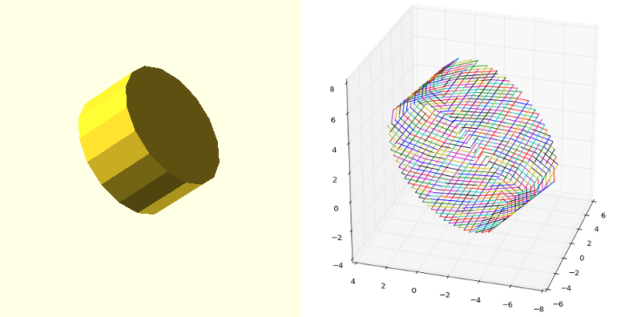

# MeshSlicer
This is a library for slicing [polygon mesh](http://en.wikipedia.org/wiki/Polygon_mesh) structures into flat polygons.



## Supported File Formats
* STL (ASCII and Binary)


## API Reference
See: [sjkelly.me/MeshSlicer.jl](http://sjkelly.me/MeshSlicer.jl/)

## Install
This package is not yet in the Julia package repository. For now, you can call ```Pkg.clone(https://github.com/sjkelly/MeshSlicer.jl.git)``` in the Julia REPL.


### Weather
[](https://travis-ci.org/sjkelly/MeshSlicer.jl)
[](https://coveralls.io/r/sjkelly/MeshSlicer.jl)

This package is developed under the latest [development verion of Julia](https://github.com/julialang/julia).

### Building Documentation
We use [Jocco](https://github.com/sjkelly/jocco). To enable the submodule, run ```git submodule update --init```.
Then use jocco from the MeshSlicer directory with
```julia ./doc/jocco/jocco.jl ./src/MeshSlicer.jl```. This will generate the 
documentation in ```doc/```. 


## Examples
* http://nbviewer.ipython.org/github/sjkelly/MeshSlicer.jl/blob/master/examples/slice_tree.ipynb


## License
The MeshSlicer.jl package is licensed under the MIT "Expat" License. See [LICENSE.md](./LICENSE.md).
